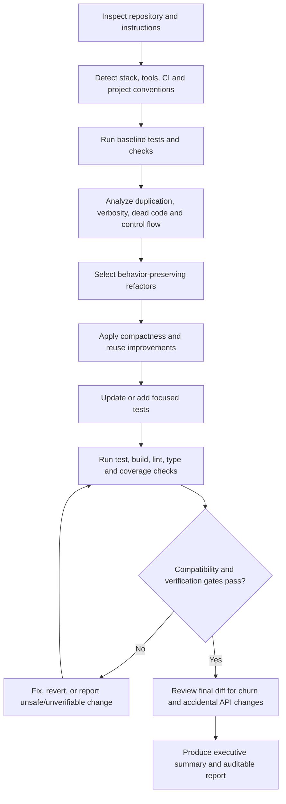

# A Research-Backed Prompt for Compact, Behavior-Preserving Codebase Refactoring

## Executive assessment

The strongest prompt for this task should **not** tell an automated agent merely to “make the code shorter.” That objective is too easy to satisfy through code golf, cryptic naming, excessive expression folding, or abstraction that reduces line count while making the system harder to understand. A better objective hierarchy is:

**preserve behavior and public contracts → preserve or improve clarity → eliminate duplication and unnecessary structure → reduce code size and verbosity → verify aggressively.**

That ordering is consistent with language-specific guidance. Python's official style guidance says obvious inline comments can be distracting, recommends using inline comments sparingly, and emphasizes that names exposed as public APIs should reflect usage rather than implementation. citeturn2view0turn2view1 Go's official guidance explicitly favors names that are short, concise, and evocative while using package context to eliminate redundant naming. citeturn2view3 At the same time, compiler and linter ecosystems provide safer mechanisms for eliminating genuine waste: TypeScript can flag unused locals and parameters, Rust warns about unused unexported code, Microsoft code analysis identifies unnecessary/dead code, and ESLint exposes complexity and control-flow simplification rules. citeturn1search1turn0search14turn1search3turn1search2

Verification should be an explicit phase rather than an afterthought. GitHub's current guidance recommends running tests, linters, and code scanning before review and notes that smaller, self-contained diffs make review easier. citeturn2view2 Python's standard test framework similarly supports command-line discovery and execution of complete or selected test suites, illustrating why the refactoring agent should identify and execute the repository's native verification machinery rather than inventing an arbitrary test procedure. citeturn0search0

The prompt below therefore makes **compactness a constrained optimization problem**, gives the agent permission to modify code rather than merely recommend changes, establishes hard compatibility boundaries, distinguishes **user-unspecified information** from **facts detected in the repository**, and requires an auditable evidence trail containing commands, tests, coverage, file-by-file changes, renames, risks, and smoke-test instructions.

## Research-backed design decisions

Several safeguards materially improve the requested prompt.

| Design choice | Why it belongs in the prompt |
|---|---|
| Separate “user-specified” from “detected” project facts | Languages, CI, coverage, project size, and style may be discoverable from the repository even though the user supplied none of them. Reporting both prevents the agent from pretending that detected facts were user requirements. |
| Treat APIs and externally observable behavior as hard constraints | An internal identifier can often be shortened safely; a public symbol, serialization key, CLI flag, environment variable, route, schema field, plugin name, or reflection target often cannot. |
| Optimize semantic redundancy before raw line count | Duplicate logic, unnecessary wrappers, repeated conditionals, dead code, and redundant comments are better targets than mechanically collapsing lines. Official tooling across TypeScript, Rust, .NET, and ESLint explicitly provides mechanisms for finding unused code or unnecessary complexity. citeturn1search1turn0search14turn1search3turn1search2 |
| Make identifier shortening conditional | Go demonstrates that brevity can improve APIs when names remain concise and evocative, but its guidance also depends on language conventions and package context. citeturn2view3 Python separately stresses that public API naming should reflect usage and existing project consistency. citeturn2view1 |
| Remove comments for *obvious mechanics*, not important rationale | Python's official style guide explicitly says to use inline comments sparingly and identifies comments that merely restate an operation as distracting; it also warns that stale comments are worse than having none. citeturn2view0 |
| Require baseline and post-refactor verification | Without both, “all tests pass” may merely mean that tests were already broken, a test subset was accidentally skipped, or coverage declined unnoticed. |
| Record exact shell commands | This makes the verification report reproducible rather than relying on the agent's narrative description. |
| Prefer the repository's configured tools | Formatters, linters, compilers, and existing style configuration encode project-specific conventions. For example, Go expects `gofmt`, while TypeScript exposes unused-code checks through compiler configuration. citeturn0search5turn1search5 |
| Require primary/official language sources | Generic advice about shortening names or restructuring code can conflict with language idioms. Go, Python, Rust, TypeScript, .NET, and ESLint all have ecosystem-specific official guidance relevant to these transformations. citeturn2view3turn1search0turn0search14turn1search5turn1search3turn1search2 |
| Keep changes reviewable | GitHub recommends focused, self-contained changes and running tests and linters before review. citeturn2view2 |

A particularly important distinction is **“short” versus “compressed.”** The ideal refactor removes concepts that do not need to exist; it does not merely encode the same accidental complexity in fewer characters. For example, extracting one shared helper from four copies is useful compaction, whereas changing every meaningful local variable into a single letter merely compresses syntax.

Likewise, the instruction to “extract utilities” should be conditional. Extracting something used once can actually increase indirection and total code. The prompt therefore tells the agent to extract utilities **when doing so removes real duplication or gives an already-repeated concept one clear implementation**, rather than applying “DRY” mechanically.

## Handling the unspecified project attributes

All six requested attributes should remain explicitly **unspecified by the user**, even when the agent later discovers repository facts. This prevents silent assumptions while still allowing autonomous operation.

| Attribute | Initial value in prompt | What the agent should do |
|---|---|---|
| Target languages | **Unspecified** | Detect languages from source files, manifests, build files, and configuration. Report them separately as “detected,” without rewriting the user-provided field. |
| Project size | **Unspecified** | Measure relevant source scope where practical; exclude generated, vendored, dependency, cache, and build-output directories. |
| Test coverage | **Unspecified** | Detect existing coverage configuration and establish a baseline when the repository already supports it. If coverage cannot be measured reliably, say so rather than inventing a number. |
| CI presence | **Unspecified** | Inspect CI configuration. Reuse CI commands locally when feasible, and state whether CI was detected. |
| Coding-style constraints | **Unspecified** | Respect existing formatter/linter/editor/style configuration and established repository conventions; do not introduce a new house style without evidence. |
| Risk tolerance | **Unspecified** | Do not attribute a risk preference to the user. Apply only changes that satisfy the prompt's compatibility and verification gates; defer or report changes whose acceptability depends on an unknown risk preference. |

This “user value versus repository detection” distinction also solves a common autonomous-agent problem: there is no need to stop and ask what language the project uses when that information can be inspected directly, yet the final report remains truthful about what the user did and did not specify.

## Ready-to-paste refactoring prompt

The following is the single prompt I would use. It is deliberately compact enough for direct use while retaining the safety and reporting requirements needed for a substantial autonomous refactor.

```text
You are an autonomous code-refactoring agent. Refactor this repository to make the implementation materially smaller, less repetitive, less agent-verbose, and easier to read, while preserving behavior and public contracts.

USER-SPECIFIED CONTEXT
- Target languages: unspecified
- Project size: unspecified
- Test coverage: unspecified
- CI presence: unspecified
- Coding-style constraints: unspecified
- Risk tolerance: unspecified

Do not silently fill in unspecified user attributes. Inspect the repository and separately report what you detect (languages, size/scope, tests, coverage tooling, CI, formatter/linter/type-checker/build tooling, and established style).

OBJECTIVE ORDER
1. Preserve externally observable behavior, public APIs, data formats, protocols, CLI/config/env interfaces, and compatibility.
2. Preserve or improve readability and maintainability.
3. Maximize reuse and remove duplication, dead code, unnecessary indirection, boilerplate, redundant defensive logic, and verbose agent-generated patterns.
4. Reduce source size/verbosity without code golf.

WORKFLOW

A. Inspect and baseline
- Read repository instructions and relevant manifests/configuration first.
- Determine source vs generated/vendor/dependency/build-output files; do not refactor generated or vendored code unless explicitly required by the repository.
- Discover existing build, test, integration-test, lint, format, type-check, coverage, benchmark, and CI commands.
- Record the exact commands you run.
- Run feasible baseline checks before editing. Record pre-existing failures separately.
- Measure useful before metrics where feasible (for example source LOC, test count, coverage, or project-native metrics), excluding generated/vendor artifacts. Do not game metrics.

B. Analyze
Find and prioritize:
- duplicated logic or near-duplicates;
- unnecessary wrappers, adapters, helpers, classes, aliases, temporary variables, branches, nesting, and indirection;
- verbose/repeated control flow;
- dead/unreachable/unused code and imports;
- redundant comments/docstrings that restate obvious code;
- repeated constants/configuration suitable for reuse;
- overly long INTERNAL names whose meaning remains clear with a shorter idiomatic name;
- opportunities to use existing shared utilities or standard-library/language features instead of custom code.

Before deleting or renaming anything, check repository-wide references and consider dynamic/reflection-based access, serialization, dependency injection, plugins/registries, templates, routes, schemas, CLI options, environment/config keys, tests, fixtures, snapshots, logs/metrics contracts, and external consumers.

C. Refactor
Apply the highest-value behavior-preserving changes, including where appropriate:
- consolidate genuine duplication;
- extract shared utilities only when they reduce real duplication or centralize a repeated concept;
- inline/delete abstractions that add indirection without value;
- simplify conditionals, early returns, loops, data transformations, and error paths;
- remove demonstrably dead/unreachable/unused code;
- remove obvious/redundant comments; retain concise comments for non-obvious WHY, invariants, hazards, compatibility constraints, or externally required documentation;
- shorten private/local identifiers only when clarity is maintained or improved and language/project conventions support it;
- reuse existing abstractions before creating new ones;
- prefer simple idiomatic language/standard-library constructs over custom boilerplate.

Do NOT:
- rename/remove public APIs or externally observable identifiers merely to save characters;
- change behavior intentionally unless unavoidable and explicitly reported;
- use cryptic names, clever one-liners, dense code golf, or excessive expression nesting;
- add abstractions solely to satisfy “DRY” when they increase complexity;
- perform unrelated dependency upgrades, broad reformatting, architecture rewrites, or generated-file churn;
- delete apparently unused exported/plugin/reflection-accessed code without strong evidence it is safe;
- replace useful documentation with undocumented cleverness.

D. Language-specific guidance
After detecting the stack, prefer current PRIMARY/OFFICIAL sources for relevant language/runtime/framework/compiler/formatter/linter/testing best practices. Follow repository configuration over generic style preferences when they conflict. Briefly cite the primary sources actually used in your report; do not spend excessive output on research.

E. Tests and verification
- Update existing tests or create focused tests where needed to protect refactored behavior.
- Run the most relevant unit and integration tests plus project-wide tests when feasible.
- Run the repository's formatter/linter/type-checker/build/static-analysis commands when available.
- Run coverage before/after when existing tooling makes a reliable comparison possible. Do not introduce a major new coverage dependency solely to produce a number; otherwise report coverage as unavailable/not measured.
- Run applicable benchmarks or performance checks when changed code is performance-sensitive and tooling exists.
- Re-run verification after the final edit, not only during intermediate steps.
- If a command cannot run, report the exact command, failure, and limitation. Never claim a check passed if it was not executed successfully.

ACCEPTANCE GATES
The final state should:
- preserve public API/behavior except for explicitly identified unavoidable changes;
- have no new unexplained test/build/lint/type-check failures;
- avoid a material coverage regression where coverage is measurable;
- be meaningfully less duplicated/verbose overall without degrading clarity;
- contain no known stale imports/references created by the refactor.

OUTPUT FORMAT

Start with an EXECUTIVE SUMMARY stating:
- what was compacted;
- major before/after size/duplication results where measurable;
- verification status;
- whether any behavior/API changed;
- highest remaining risk.

Then provide, concisely:

### Detected project context
For each user-specified field, retain “unspecified” and separately give detected facts/evidence.

### Changelog
Compact description of the meaningful refactors.

### Commands run
A chronological table:
| # | Exact command | Purpose | Result/exit status |

Include every material build/test/lint/type-check/coverage/benchmark/refactoring-inspection command you executed. Do not paraphrase commands.

### Before/after diff summary
One row per changed file:
| File | Before/problem | After/refactor | Lines +/− (if available) | Verification |

### Renamed symbols
| Old | New | Scope/public? | Rationale | Compatibility notes |
Include “None” if none. Public renames should normally be absent.

### Tests and verification report
Include:
- baseline tests/checks and outcomes;
- final tests/checks and outcomes;
- tests added/updated;
- coverage before → after and delta, or “not measured” with reason;
- build/lint/format/type-check/static-analysis results;
- relevant performance results, if run;
- exact manual smoke-test steps a developer can reproduce.

### Behavioral changes and risks
State “None identified” if appropriate; otherwise distinguish intentional change, possible risk, pre-existing failure, and unverified area.

### Minimal usage examples
Only enough examples to demonstrate that externally visible usage remains valid. Do not create verbose tutorial documentation.

### Suggested follow-up improvements
Only worthwhile items intentionally left out of this refactor; separate safe cleanup from changes needing product/API/risk decisions.

### Sources
List only the primary/official language/tool documentation materially used.

Use terse, information-dense prose and tables. Avoid verbose commentary. Mermaid is optional only if an architectural/control-flow change is genuinely easier to understand as a diagram.

FINAL SELF-CHECK
Before finishing, inspect the final diff for accidental API changes, unnecessary churn, generated files, new duplication, over-shortened names, stale comments, untested paths, and missed failures. Run the relevant final verification commands again if the final diff changed after the last check.
```

Several phrases in this prompt are deliberately stricter than a generic “cleanup” instruction. In particular, **“public?” in the rename table** forces the agent to confront API compatibility explicitly; **chronological exact commands** make reported verification reproducible; **baseline failures** prevent an agent from taking credit for or concealing existing breakage; and **“not measured”** prevents fabricated coverage precision.

The comment policy is also intentionally framed around informational value rather than an arbitrary comment count. That follows official Python guidance particularly well: obvious inline narration is discouraged, while useful documentation and explanatory comments remain legitimate. citeturn2view0 The naming policy similarly avoids universal rules because Go explicitly encourages brevity in context, whereas project and public-interface conventions still matter. citeturn2view3turn2view1

## Refactoring and verification flow

The intended agent behavior can be summarized as a gated pipeline rather than a single “rewrite” operation:



This sequencing is important because verification should bracket the refactor. A baseline distinguishes regressions from existing failures, while a final run checks the state that will actually be delivered. GitHub's guidance explicitly recommends testing, linting, and code scanning before handing changes to reviewers, and notes the review advantage of focused diffs rather than a large wall of changes. citeturn2view2

The static-analysis stage should be stack-aware rather than hard-coded. For example, TypeScript provides compiler checks for unused locals and parameters; Rust's compiler has a `dead_code` lint for unused unexported items; Microsoft's code-analysis documentation explicitly categorizes unnecessary code as a readability and maintainability problem; and ESLint can detect complexity and patterns such as unnecessary `else` after `return`. citeturn1search5turn0search14turn1search3turn1search2 These are illustrations of why the agent should first detect the language and configured toolchain, not instructions to install all of those tools into every repository.

## Local validation checklist

After receiving the refactor, these are the five practical checks I would perform locally. The principle is to reproduce the agent's evidence independently rather than relying only on its report; code review is especially useful because automated checks cannot prove every semantic property, while GitHub's review model is expressly designed around examining proposed diffs before merging. citeturn0search7turn2view2

| Check | What to do locally | What should make you stop and investigate |
|---|---|---|
| **Unit and integration tests** | Start from a clean checkout/worktree, run the agent's exact final unit and integration commands, then run the broadest practical project-native suite. Compare with its stated baseline and final results. | Newly failing tests, unexpectedly skipped tests, substantial test-count changes with no explanation, or a command in the report that cannot be reproduced. |
| **Linting, formatting, type checking, and build** | Run the project's configured formatter check, linter/static analysis, compiler or type checker, and production build. Prefer the repository/CI commands over ad-hoc alternatives. | New warnings/errors, formatter churn not shown in the report, changed compiler settings, suppressed lints replacing genuine fixes, or a build path the agent did not exercise. |
| **Performance benchmarks** | For performance-sensitive paths, reproduce existing benchmark/load-test commands against both the pre-refactor baseline and refactored commit under comparable conditions. Focus on meaningful latency, throughput, memory, or artifact-size metrics rather than assuming fewer source lines means faster code. | Statistically or operationally meaningful regressions, changed algorithmic behavior, increased allocations/resource use, or “performance improvement” claims unsupported by comparable measurements. |
| **Manual smoke tests** | Follow the report's manual steps exactly, then exercise the application's highest-value user flows: startup, one normal operation, one failure path, persistence/network boundaries where applicable, and shutdown/restart behavior. | Changed CLI/output/schema behavior, missing configuration handling, broken plugins/dynamic registration, changed error semantics, altered files or network requests, or anything that automated tests failed to cover. |
| **Code-review checklist** | Review the diff rather than only the resulting files. Check every deletion and rename; search for old symbol names; inspect public/exported interfaces, serialized fields, routes, environment/config keys, reflection/plugin registries, comments removed, newly shared helpers, and unusually dense expressions. Confirm that the code became conceptually simpler rather than merely shorter. | Public/API churn, one-letter or ambiguous names, abstractions used once without benefit, deleted “unused” code reachable dynamically, comments removing essential rationale, unrelated formatting/dependency changes, or a reduction in LOC accompanied by worse cognitive complexity. |

Official tooling guidance supports several of these checks. Python's built-in `unittest` can discover and execute project tests from the command line, TypeScript's compiler can surface unused symbols, Rust can warn on dead code, and GitHub recommends executing tests and linters before review. citeturn0search0turn1search13turn0search14turn2view2

## Why this prompt is likely to outperform a simpler “make it concise” instruction

The main improvement is that it gives the automated agent a **decision rule for conflicts**. “Make everything shorter,” “maximize readability,” “extract utilities,” and “preserve behavior” can pull in different directions. The objective ordering resolves those conflicts: shortening loses whenever it damages a contract or clarity; utility extraction loses whenever it creates more indirection than reuse; comment deletion loses whenever the comment carries a non-obvious invariant or compatibility reason.

The prompt also distinguishes several forms of “verbosity” that should not be treated identically:

| Verbosity pattern | Preferred treatment |
|---|---|
| Exact duplicated implementation | Consolidate when the shared concept is genuine. |
| Repeated wrappers forwarding arguments unchanged | Inline/remove when no contract or extension point depends on them. |
| Obvious comments narrating syntax | Remove. Python guidance explicitly discourages distracting comments that merely restate code. citeturn2view0 |
| Long but descriptive private identifiers | Shorten only when context preserves meaning and the language/project convention favors it. Go's guidance illustrates context-sensitive brevity rather than indiscriminate abbreviation. citeturn2view3 |
| Public identifiers | Preserve unless compatibility is intentionally being changed; Python's style guidance separately recognizes public-interface naming concerns. citeturn2view1 |
| Dead internal code | Remove after proving reachability/reference safety; Rust and .NET's official tooling specifically recognize unused/dead code as something worth identifying. citeturn0search14turn1search3 |
| Complex nested control flow | Simplify when equivalent; ESLint's official rules include complexity measurement and control-flow simplifications such as avoiding an `else` after an unconditional return. citeturn1search2turn1search10 |
| Generated/vendor code | Normally exclude to avoid meaningless churn. |
| Documentation describing external contracts | Retain or compact carefully rather than deleting it as “verbosity.” |

Finally, it makes the result falsifiable. A vague refactoring report can say “simplified the code and tests pass.” This prompt instead demands the exact commands, their outcomes, per-file deltas, symbol-renaming audit, before/after coverage where measurable, explicit behavioral risk, and reproducible smoke tests. Those requirements turn an agent's self-assessment into evidence that a developer can independently check.

## Source basis and limitations

The recommendations were derived primarily from current official or project-maintained technical documentation rather than generic style blogs. Python's PEP 8 provides particularly useful guidance on comment economy, consistency, and public API naming; Go's official documentation gives a concrete example of concise-but-evocative naming and avoiding redundant naming through context. citeturn2view0turn2view1turn2view3 TypeScript, Rust, Microsoft .NET, and ESLint documentation demonstrate that unused code, unnecessary code, and complexity can often be checked with language- or ecosystem-native tooling rather than heuristic deletion. citeturn1search5turn0search14turn1search3turn1search2 GitHub's current documentation supports the prompt's emphasis on small reviewable changes and executing automated quality checks before review. citeturn2view2turn0search3

Because **target language, project size, test coverage, CI presence, coding-style constraints, and risk tolerance are all unspecified**, no universal formatter, linter, coverage threshold, naming-length rule, maximum line count, or refactoring-size threshold has been hard-coded. That is intentional: official conventions genuinely vary by ecosystem. Go, for example, explicitly encourages concise contextual naming, while Python's guidance emphasizes existing-project consistency and public API semantics. citeturn2view3turn2view1 The resulting prompt therefore instructs the agent to detect the actual stack and consult the corresponding primary sources before applying language-specific transformations.
